# 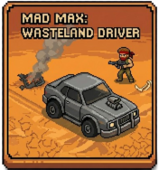 Mad Max: Wasteland Driver

> Videojuego 2D arcade de conducción con vista cenital desarrollado en **Java Swing & AWT**

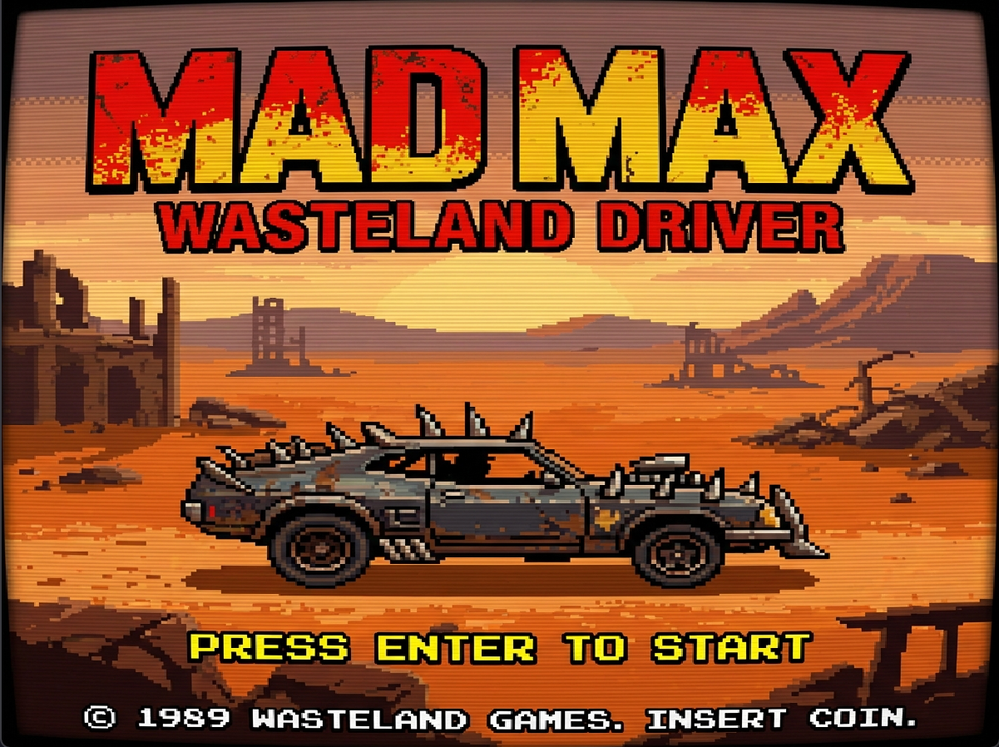

---

## Índice

1. [Introducción](#1-introducción)
2. [Estructura del Proyecto](#2-estructura-del-proyecto)
3. [Tecnologías y Conceptos Aplicados](#3-tecnologías-y-conceptos-aplicados)
4. [Mecánicas del Juego](#4-mecánicas-del-juego)
5. [Implementación Técnica](#5-implementación-técnica)
6. [Recursos Gráficos y de Audio](#6-recursos-gráficos-y-de-audio)
7. [Interfaz de Usuario (HUD)](#7-interfaz-de-usuario-hud)
8. [Estados del Juego](#8-estados-del-juego)
9. [Ejecución y Compilación](#9-ejecución-y-compilación)
10. [Conclusiones](#10-conclusiones)

---

## 1. Introducción

### 1.1 Descripción del Proyecto

Mad Max: Wasteland Driver es un videojuego 2D desarrollado en Java utilizando las bibliotecas Swing y AWT para los gráficos, y javax.sound para el audio. El juego está inspirado en el estilo de los clásicos arcade de conducción con vista cenital.

### 1.2 Objetivo del Juego

El jugador controla un vehículo en un mapa abierto donde debe:

- Atropellar peatones y destruir vehículos para ganar puntos.
- Lograr los puntos requeridos para pasar a la siguiente oleada.
- Superar múltiples oleadas.


### 1.3 Justificación del Diseño

Inicialmente, el proyecto se planteó como un juego estilo GTA (Grand Theft Auto) con vista cenital. Sin embargo, durante la fase de diseño se tomó la decisión de cambiar a una ambientación desértica estilo Mad Max por las siguientes razones:

1. **Simplificación del sistema de colisiones:** Un entorno urbano requeriría implementar un sistema de mapeo complejo donde el jugador no pudiera atravesar edificios, calles con bordes, etc. El desierto abierto permite movimiento libre sin estas restricciones.

2. **Reducción de assets necesarios:** Un entorno urbano necesitaría múltiples sprites de edificios, aceras, señales de tráfico, etc. El desierto solo requiere un mapa de fondo cohesivo.

3. **Estética cohesiva:** La temática post-apocalíptica de Mad Max permite justificar un mundo desolado con pocos elementos, vehículos deteriorados y un estilo visual más sencillo pero atractivo.

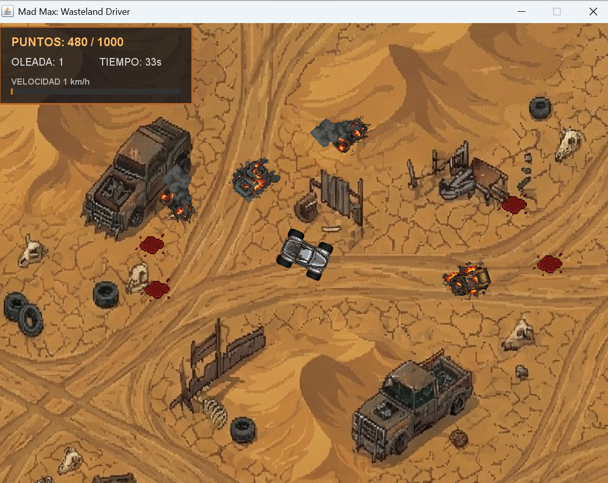

---

## 2. Estructura del Proyecto

### 2.1 Organización de Archivos

```
madMaxGame/
├── src/
│   ├── madMax/
│   │   ├── MadMax.java        # Clase principal
│   │   ├── Coche.java         # Clase vehículo
│   │   ├── Peaton.java        # Clase peatón
│   │   └── ManchaSangre.java  # Efecto visual
│   ├── images/                # Sprites y texturas
│   ├── music/                 # Audio
│   └── module-info.java
└── bin/                       # Clases compiladas
```

**Total de líneas de código:** ~770 líneas

### 2.2 Diagrama de Clases

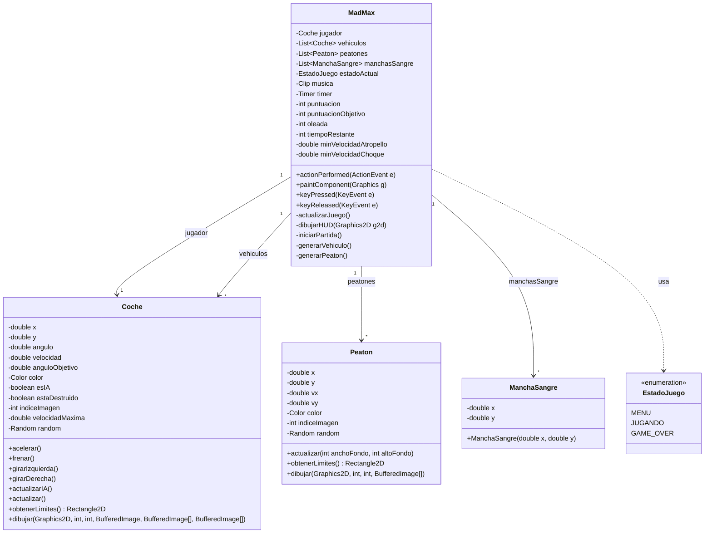


---

## 3. Tecnologías y Conceptos Aplicados

### 3.1 Bibliotecas Utilizadas

| Biblioteca | Uso |
|------------|-----|
| `javax.swing.*` | Interfaz gráfica (JPanel, JFrame, Timer) |
| `java.awt.*` | Gráficos 2D, colores, formas geométricas |
| `java.awt.event.*` | Manejo de eventos de teclado |
| `java.awt.geom.*` | Transformaciones 2D (rotación, traslación) |
| `java.awt.image.BufferedImage` | Almacenar imágenes en memoria |
| `javax.imageio.ImageIO` | Carga de imágenes PNG |
| `javax.sound.sampled.*` | Reproducción de audio WAV |
| `java.util.ArrayList` / `List` | Colecciones de objetos del juego |
| `java.util.Random` | Generación de números aleatorios |

### 3.2 Patrones de Diseño Implementados

1. **Game Loop Pattern:** Uso de `javax.swing.Timer` para ejecutar el bucle del juego a ~60 FPS

2. **State Pattern:** Enum `EstadoJuego` para gestionar los estados (MENU, JUGANDO, GAME_OVER)

3. **Observer Pattern:** Implementación de `KeyListener` para eventos de teclado

**Definición de Estados del Juego:**

```java
// Definición de Estados del Juego
public enum EstadoJuego {
    MENU,
    JUGANDO,
    GAME_OVER
}
```


---

## 4. Mecánicas del Juego

### 4.1 Sistema de Oleadas

Al alcanzar la puntuación objetivo, se avanza de oleada:
- La puntuación objetivo aumenta en cada oleada
- Se generan más enemigos y peatones
- El temporizador se reinicia a 60 segundos
- La velocidad máxima del jugador aumenta
- La velocidad mínima requerida para destruir enemigos y atropellar peatones aumenta

```java
// Si llegamos a los puntos necesarios, pasamos de ronda
if (puntuacion >= puntuacionObjetivo) {
    oleada++;
    puntuacionObjetivo += 1500;
    tiempoRestante = 60;
    jugador.setVelocidadMaxima(jugador.getVelocidadMaxima() + oleada);
    // Al pasar a la siguiente oleada, se crean 15 coches y peatones más
    for (int i = 0; i < 15; i++) {
        generarVehiculo();
        generarPeaton();
    }
}
```


### 4.2 Sistema de Controles

| Tecla | Acción |
|-------|--------|
| **W** / **↑** | Acelerar hacia adelante |
| **S** / **↓** | Retroceder |
| **A** / **←** | Girar izquierda |
| **D** / **→** | Girar derecha |
| **ENTER** | Iniciar partida (desde menú) |
| **R** | Reintentar (desde Game Over) |
| **M** | Volver al menú (desde Game Over) |


### 4.3 Sistema de Puntuación

| Acción | Puntos |
|--------|--------|
| Atropellar peatón | +15 |
| Destruir vehículo | +70 |

Aquí podemos ver como tras colisionar con dos peatones tenemos 30 puntos.

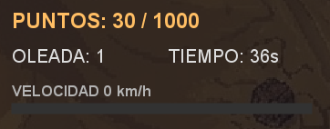

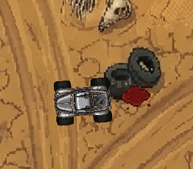

---

## 5. Implementación Técnica

### 5.1 Game Loop (Bucle Principal)

El juego utiliza un `Timer` de Swing que ejecuta `actionPerformed()` cada 16ms (~60 FPS):

```java
// El timer corre siempre, pero la lógica depende del estado
// 16ms es aproximadamente 60 imágenes por segundo (FPS)
timer = new Timer(16, this);
timer.start(); // Arranca el juego

@Override
public void actionPerformed(ActionEvent e) {
    if (estadoActual == EstadoJuego.JUGANDO) {
        actualizarJuego(); // Lógica del juego
    }
    repaint(); // Repinta el juego
}
```


### 5.2 Sistema de Cámara

La cámara sigue al jugador con suavizado (interpolación):

```java
camaraX += (jugador.getX() - camaraX) * 0.1;
camaraY += (jugador.getY() - camaraY) * 0.1;
```

Con esto conseguimos que aunque la cámara comience con el coche del jugador justo en el centro, cuando empieza a moverse, ésta lo sigue poco a poco, dando la sensación de que lo siguiese un dron o un helicóptero y no algo tan artificial como que fuese pegada al coche constantemente con él en el centro.

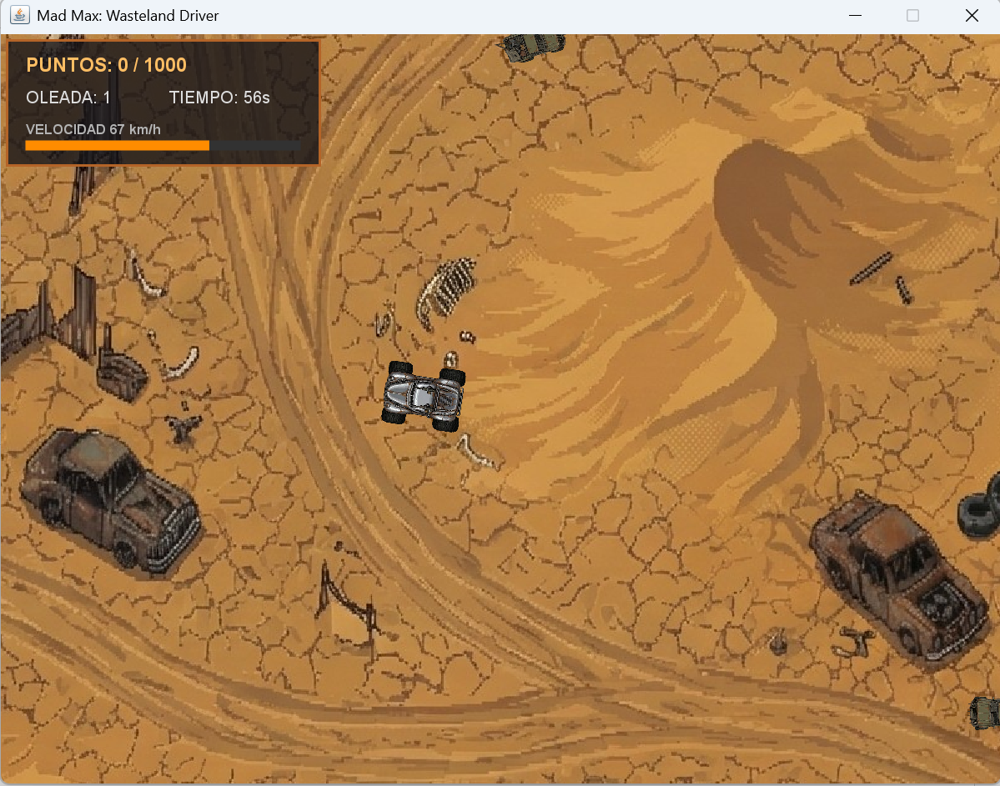

### 5.3 Detección de Colisiones

Se utilizan hitboxes rectangulares con `Rectangle2D`:
- Colisión jugador-peatón: genera mancha de sangre y suma puntos
- Colisión jugador-vehículo: cambia sprite a versión destruida

**Colisión jugador-peatón:**

```java
// Colisión jugador-peatón
if (jugador.obtenerLimites().intersects(p.obtenerLimites()) && Math.abs(jugador.getVelocidad()) > minVelocidadAtropello) {
    manchasSangre.add(new ManchaSangre(p.getX(), p.getY()));
    peatones.remove(i);
    puntuacion += 15;
    generarPeaton();
}
```

**Colisión jugador-vehículo:**

```java
// Colisión jugador-vehículo
if (jugador.obtenerLimites().intersects(v.obtenerLimites()) && !v.isEstaDestruido()) {
    // Verificamos si vamos lo suficientemente rápido para destruirlo
    if (Math.abs(jugador.getVelocidad()) > minVelocidadChoque) {
        v.setEstaDestruido(true);
        puntuacion += 70;
    }
}
```

### 5.4 Inteligencia Artificial de Vehículos

Los NPCs tienen un comportamiento simple de movimiento aleatorio en un ángulo de 360º:
- Se mueven en direcciones aleatorias dentro del mapa
- Interpolan suavemente hacia un ángulo objetivo
- Se desaceleran cuando están destruidos

```java
public void actualizarIA() {
    if (estaDestruido) {
        velocidad *= 0.90; // Desacelera si está destruido
        return;
    }

    velocidad = 2 + random.nextDouble();
    if (random.nextInt(100) == 0)
        anguloObjetivo = random.nextDouble() * Math.PI * 2;

    // Interpolación hacia el ángulo objetivo
    double diff = anguloObjetivo - angulo;
    while (diff > Math.PI)
        diff -= Math.PI * 2;
    while (diff < -Math.PI)
        diff += Math.PI * 2;
    angulo += diff * 0.03;
}
```

---

## 6. Recursos Gráficos y de Audio

Todos los assets gráficos fueron creados específicamente para este proyecto, manteniendo una estética cohesiva en estilo pixel art con vista cenital, acorde con la temática post-apocalíptica de Mad Max.

### 6.1 Diseño del Mapa

El mapa (`fondo.png`) fue diseñado como un terreno desértico abierto que permite el movimiento libre del jugador. Esta decisión de diseño simplifica considerablemente la lógica de colisiones, ya que no es necesario implementar barreras físicas como edificios o muros.

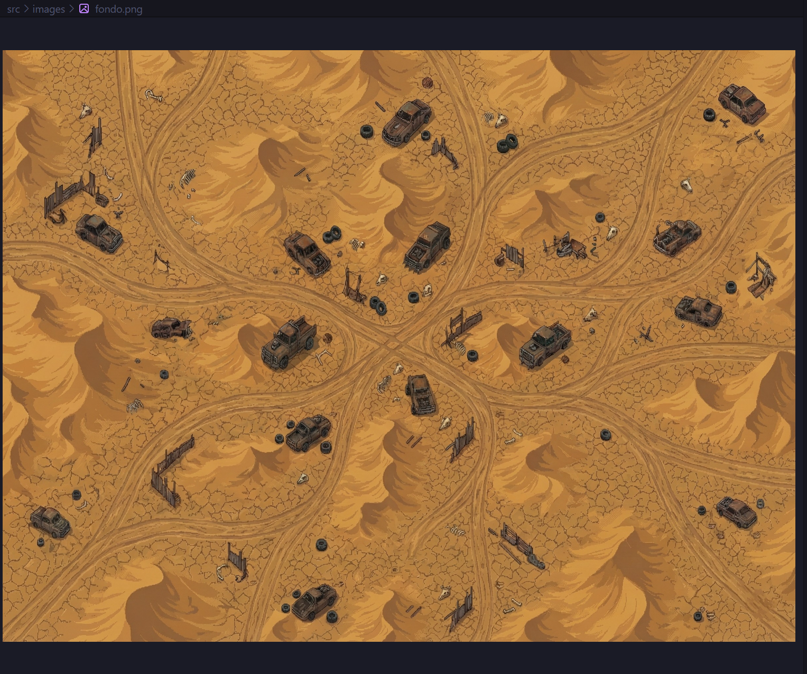

### 6.2 Sprites de Peatones

Se crearon 4 sprites diferentes de peatones (`peaton1.png` a `peaton4.png`) para dar variedad visual al juego. Cada peatón se selecciona aleatoriamente al generarse.

**Easter Egg:** Uno de los peatones (`peaton4.png`) es V, el protagonista del videojuego Cyberpunk 2077, añadido como guiño y referencia a otro título de mundo abierto.

Cuando el jugador colisiona con un peatón, el sprite del peatón es reemplazado por el sprite de sangre (`sangre.png`), creando un efecto visual de impacto.

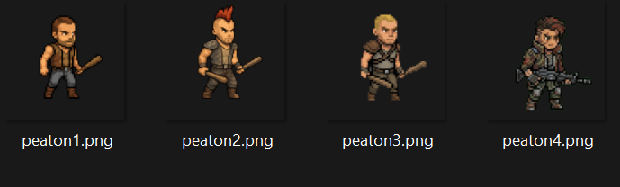


### 6.3 Sprites de Vehículos

Para los vehículos enemigos (NPCs) se crearon 4 diseños diferentes, cada uno con dos versiones. Cuando el jugador embiste un vehículo enemigo, el sprite normal es intercambiado por su versión destruida, mostrando daños visuales como abolladuras, cristales rotos y humo.

| Vehículo | Estado Normal | Estado Destruido |
|:--------:|:-------------:|:----------------:|
| **Vehículo 1** | `npc_car1.png`<br> | `npc_car1_destruido.png`<br> |
| **Vehículo 2** | `npc_car2.png`<br> | `npc_car2_destruido.png`<br> |
| **Vehículo 3** | `npc_car3.png`<br> | `npc_car3_destruido.png`<br>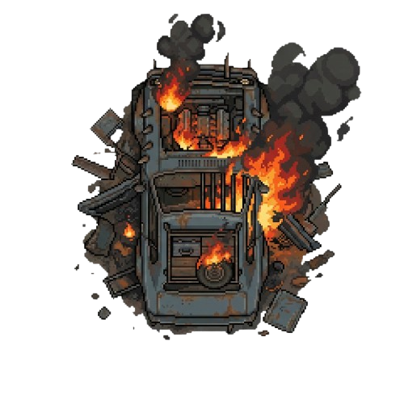 |
| **Vehículo 4** | `npc_car4.png`<br>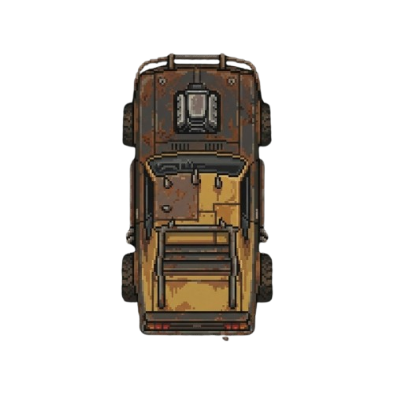 | `npc_car4_destruido.png`<br> |

### 6.4 Sprites del Jugador

El vehículo del jugador (`coche_jugador.png`) tiene un diseño distintivo que lo diferencia claramente de los NPCs, siguiendo la estética de los Interceptor de las películas Mad Max.

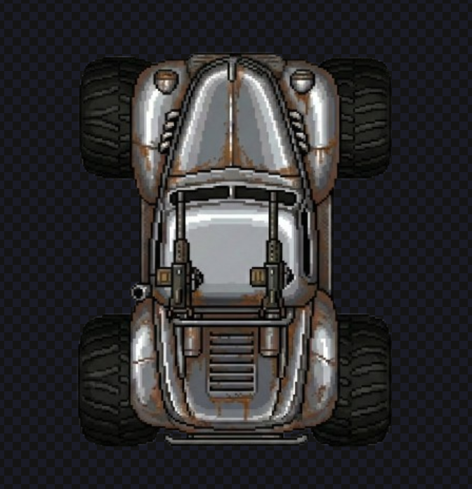

### 6.5 Tabla Resumen de Assets

| Recurso | Descripción |
|---------|-------------|
| `title_screen.png` | Pantalla de título |
| `game_over.png` | Pantalla de fin de partida |
| `fondo.png` | Mapa del desierto |
| `coche_jugador.png` | Sprite del vehículo del jugador |
| `npc_car1-4.png` | 4 sprites de vehículos enemigos |
| `npc_car1-4_destruido.png` | 4 sprites de vehículos destruidos |
| `peaton1-4.png` | 4 sprites de peatones (incluye Easter Egg) |
| `sangre.png` | Efecto de sangre al atropellar |
| `musica.wav` | Música de fondo |

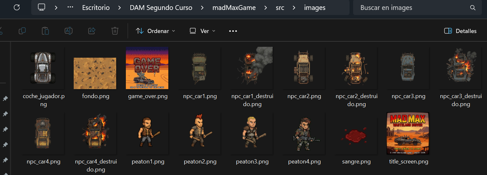

### 6.6 Carga de Recursos

Todos los recursos se cargan usando `getClass().getResource()` para que funcionen tanto en desarrollo como empaquetados en un JAR ejecutable:

Las imágenes se cargan desde `/images/`:

```java
try {
    java.net.URL url = getClass().getResource("/images/coche_jugador.png");
    if (url != null)
        imagenCocheJugador = ImageIO.read(url);
} catch (Exception e) {
    System.out.println("Error cargando coche jugador: " + e.getMessage());
}
```

El audio se carga desde `/music/`:

```java
if (musica == null) { // Solo cargamos la primera vez
    java.net.URL url = getClass().getResource("/music/musica.wav");
    if (url == null) {
        System.out.println("AVISO: No se encontró 'musica.wav' en recursos.");
        return;
    }

    AudioInputStream audioIn = AudioSystem.getAudioInputStream(url);
    musica = AudioSystem.getClip();
    musica.open(audioIn);
}
```

**Ventaja:** Este método permite que los recursos se incluyan dentro del JAR, haciendo el ejecutable portátil y autocontenido.

---

## 7. Interfaz de Usuario (HUD)

El HUD muestra información en tiempo real:

- **Puntuación actual / Objetivo**
- **Número de oleada**
- **Tiempo restante** (se pone rojo si < 10s)
- **Barra de velocidad**

```java
private void dibujarHUD(Graphics2D g2d) {
    // Fondo semi-transparente
    g2d.setColor(new Color(20, 20, 25, 200));
    g2d.fillRect(x, y, ancho, alto);

    // Puntos en dorado
    g2d.setColor(new Color(255, 190, 100));
    g2d.drawString("PUNTOS: " + puntuacion + " / " + puntuacionObjetivo, ...);
}
```

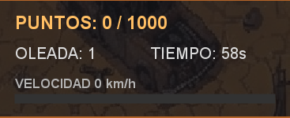

---

## 8. Estados del Juego

### 8.1 Máquina de Estados

```
┌─────────┐                    ┌──────────────┐
│  MENU   │ ───(ENTER)──────►  │   JUGANDO    │
└─────────┘                    └──────────────┘
     ▲                               │
     │                               │
     │                    ┌──────────┴──────────┐
     │                    │                     │
     │           (Tiempo = 0)          (Puntos >= Objetivo)
     │                    │                     │
     │                    ▼                     │
     │             ┌───────────┐                │
     ├────(M)──────│ GAME_OVER │                │
     │             └───────────┘                │
     │                    │                     │
     │                   (R)                    │
     │                    │                     │
     │                    ▼                     │
     │             (Reintentar)                 │
     │                    │                     │
     └────────────────────┴─────────────────────┘
                         
                   (Siguiente oleada)
```


---

## 9. Ejecución y Compilación

### 9.1 Requisitos

- **Java JDK 17** o superior
- IDE recomendado: Eclipse / IntelliJ IDEA

### 9.2 Ejecutable Windows

El juego incluye un ejecutable independiente para Windows:

📁 **`dist/Mad Max Wasteland Driver.exe`**

Solo descárgalo y ejecútalo, no requiere Java instalado.

### 9.3 Compilación desde código

1. Clonar el repositorio
2. Compilar con javac o importar en tu IDE
3. Ejecutar con:

```bash
java --module-path bin -m madmax/madMax.MadMax
```


---

## 10. Conclusiones

### 10.1 Aprendizajes

- Uso de **Java Swing** para desarrollo de videojuegos 2D
- Implementación de un **game loop** funcional
- Manejo de **eventos de teclado** en tiempo real
- **Transformaciones 2D** (rotación de sprites)
- **Detección de colisiones** con geometría
- Gestión de **estados de juego**
- **Carga y reproducción de audio** con javax.sound
- **Creación de assets gráficos** cohesivos en estilo pixel art
- **Intercambio dinámico de sprites** según el estado del juego

### 10.2 Posibles Mejoras Futuras

- [ ] Añadir más tipos de enemigos
- [ ] Implementar power-ups
- [ ] Sistema de vidas
- [ ] Guardar puntuaciones máximas
- [ ] Incorporar animaciones a los sprites
- [ ] Añadir sonidos para colisiones, aceleración del vehículo, etc.

---

*Proyecto desarrollado para el módulo de Desarrollo de Interfaces - 2º DAM*

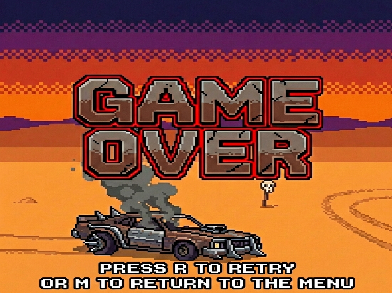
